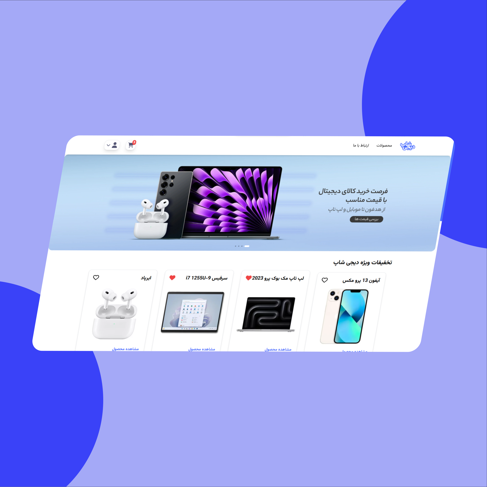

# Digi Shop


## About the project
A fully functional and dynamic shopping app with numerous features, including an admin panel and backend, built using Next.js and Tailwind CSS. It's one of my first Next.js projects that I also used React Query for fetching the data

## Features
- The ability to sort all the products by category and time or using search bar
- Both user and admin panel
- Autentication uising otp !
- A contact us section
- Cart and Pyament components
- Completely responsive in every viewpoint

If you want to see the live website you can click [here](https://digishop-app.ir) or check my [portfolio](https://seyedalinajafi.ir).

## Installation
If you want to install this project you have to do the steps below and if you want the backend file contact me.
```bash
git clone https://github.com/SeyedAliNajafi/Digi-Shop.git
npm install
npm run dev
```
